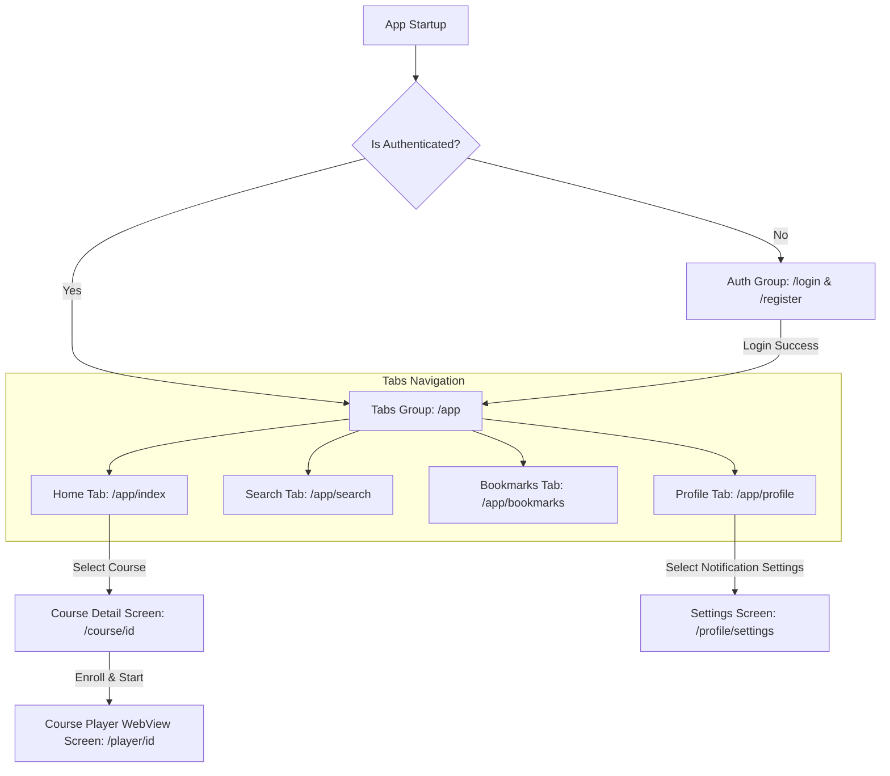
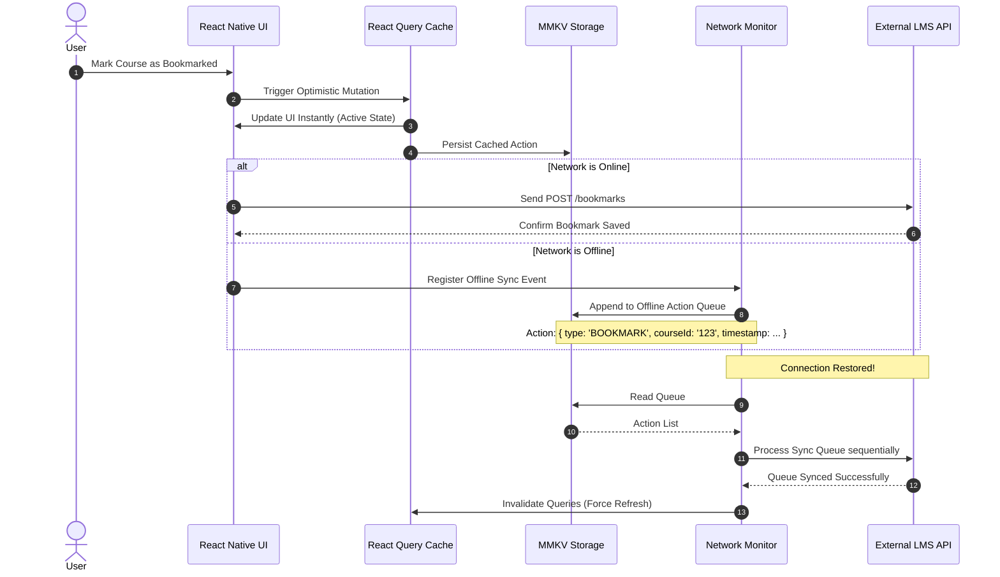
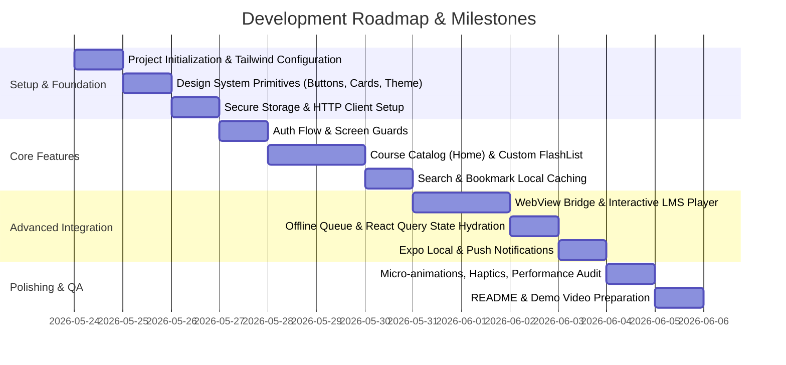

# Production-Ready Mini LMS Mobile App - Architectural Blueprint & Implementation Plan

This document details the comprehensive system architecture, product design framework, and screen-by-screen development roadmap for the **Mini LMS Mobile App**. It has been designed by a senior React Native architect and lead product designer to ensure startup-level aesthetic appeal, elite engineering practices, robust offline resilience, and production-level modularity.

---

## 1. Goal Description

The objective is to design and implement a production-grade, highly engaging, and performant **Mini LMS (Learning Management System)** mobile application using **React Native Expo (SDK 51+)**, **TypeScript (Strict Mode)**, **Expo Router**, **NativeWind (Tailwind CSS)**, and **Zustand / React Query**. 

The app will offer a premium user experience resembling industry leaders like Coursera, Airbnb, and Linear. It will feature local caching, offline capabilities, secure authentication, native-to-web messaging, background notifications, and elegant micro-animations.

---

## 2. User Review Required

Before commencing Phase 4 (screen-by-screen coding), we require your review and approval on the following architectural decisions and product assumptions:

> [!IMPORTANT]
> **Key Architecture Decisions for Approval:**
> 1. **MMKV vs. AsyncStorage:** We propose using **`react-native-mmkv`** for fast key-value storage (course cache, user settings, offline queue) due to its C++ synchronous bindings. We will use **`expo-secure-store`** exclusively for sensitive auth credentials (JWTs, user secrets).
> 2. **State Division:** **Zustand** will handle transient UI states, theme configurations, and the offline sync queue. **React Query (TanStack Query)** will manage server data fetching, query caching, background polling, and optimistic mutations.
> 3. **WebView Architecture:** To play highly interactive course elements or external quizzes, we will establish a structured **bi-directional JSON-RPC protocol** via the WebView's `onMessage` and `injectJavaScript`.

> [!WARNING]
> **Tailwind v4 vs. NativeWind v2/v4:**
> We will utilize **NativeWind v4** (which leverages Tailwind CSS v3/v4 configurations under the hood) to ensure complete compatibility with Expo Router and Metro bundler. Please let us know if you have a specific Tailwind version preference.

---

## 3. Open Questions

> [!IMPORTANT]
> **Please review these design/architectural questions:**
> 1. Do we have a live backend endpoint/API, or should we design a complete mock API layer using Mock Service Worker (MSW) or a local mock server with full network delay simulation and offline triggers? *(We highly recommend building an offline-first simulated client interceptor inside the app for seamless standalone testing and review).*
> 2. Are there specific LMS authentication modes required (e.g., Google OAuth, Apple Sign-in) alongside standard email/password JWT flow?

---

# PHASE 1: Product Thinking, Architecture, & System Design

## 1.1 Product Thinking & Feature Breakdown
A premium LMS shouldn't feel like a static list of links. It must feel **fluid, contextual, and encouraging**. Below is the product feature breakdown:

*   **Continuous Learning Flow:** A "Resume Course" dashboard widget that immediately restores the player state to the exact millisecond of the video or specific node inside the WebView.
*   **Intelligent Offline Sync:** The app doesn't just block the user when offline; it caches all text-based content, video bookmarks, and quiz progress. If the user completes a quiz offline, the app queues the mutation and syncs it silently when connection is restored.
*   **Contextual Search & Filtering:** Instant fuzzy search with quick tags (e.g., "In Progress," "Not Started," "Completed") and category bubbles.
*   **Webview Bridge:** Embedded interactive modules (like HTML5 widgets, dynamic diagrams, or external quizzes) communicate their state changes (e.g., "slide_completed", "score_achieved") directly to the native React Native shell.

---

## 1.2 User Flow & Screen Navigation Map
The application utilizes Expo Router’s file-based routing. The flows are strictly divided into authenticated and unauthenticated groups:



---

## 1.3 System & Architecture Decisions

| System Layer | Selected Technology | Technical Rationale |
| :--- | :--- | :--- |
| **Routing** | `expo-router` | Native tab/stack handling, deep linking, dynamic route parameters, and static file-based configuration. |
| **Global Client State** | `zustand` | Ultra-lightweight, zero-boilerplate state store that integrates easily with MMKV for persistence. |
| **Server State / Cache**| `@tanstack/react-query` | Automated query caching, background refetch-on-reconnect, optimistic updates, and automatic retry behaviors. |
| **Storage (Secure)** | `expo-secure-store` | Hardware-encrypted key-value store for JWT tokens. |
| **Storage (Fast Cache)** | `react-native-mmkv` | Extremely fast synchronous storage for query cache serialization, offline queue, and user theme settings. |
| **Styling** | `nativewind` (Tailwind) | Utility-first styling compile-time transformed to StyleSheet, avoiding runtime calculation bottlenecks. |
| **Animations** | `react-native-reanimated` | Declarative 60fps animations run directly on the UI thread. |
| **Lists** | `@shopify/flash-list` | Highly optimized recycler view replacing standard FlatList, reducing cell-rendering blank spaces. |
| **WebView** | `react-native-webview` | Secure sandboxed component to run rich media, animations, and dynamic interactive modules. |

---

## 1.4 Dynamic State Flow (Zustand & React Query Offline Sync)



---

## 1.5 Folder Structure (Senior-Level Clean Architecture)
We propose a highly professional, domain-driven structure that keeps components highly modular, testable, and isolated.

```text
mini-lms-app/
├── assets/                     # Splash screen, app icons, premium fonts
├── src/
│   ├── api/                    # API Clients, HTTP interceptors, types
│   │   ├── client.ts           # Axios / Fetch client configured with retries
│   │   ├── courses.ts          # Course-specific endpoint abstractions
│   │   └── types.ts            # Global TypeScript API schemas
│   ├── components/             # Reusable UI Primitives (Design System)
│   │   ├── ui/                 # Pure atomic elements (Button, Input, Card, Text)
│   │   ├── feedback/           # SkeletonLoader, Toast, EmptyState, ErrorBoundary
│   │   └── modules/            # Domain-specific components (CourseRow, ReviewCard)
│   ├── hooks/                  # Custom global React hooks
│   │   ├── useAuth.ts          # Authentication hooks wrapper
│   │   ├── useOffline.ts       # Network connectivity & sync hook
│   │   ├── useWebViewBridge.ts # Custom protocol for WebView postMessage
│   │   └── useDebounce.ts      # Debouncer for search query fields
│   ├── navigation/             # Navigation configuration, routing guards
│   ├── store/                  # Zustand global client state stores
│   │   ├── useAuthStore.ts     # Global auth state & token storage
│   │   ├── useThemeStore.ts    # Dynamic theme preference (Light/Dark)
│   │   └── useOfflineStore.ts  # Queue management for offline mutations
│   ├── theme/                  # Theme variables, typography definitions, standard shadows
│   ├── utils/                  # Safe helpers, validation, type-guards
│   └── views/                  # Screen views containing business logic layout
├── app/                        # Expo Router entry directories (File-based)
│   ├── (auth)/                 # Unauthenticated: login, register
│   ├── (tabs)/                 # Main Bottom Tabs Navigation
│   │   ├── index.tsx           # Home Feed Screen
│   │   ├── search.tsx          # Search Screen
│   │   ├── bookmarks.tsx       # Saved Courses Screen
│   │   └── profile.tsx         # User Profile & Settings Screen
│   ├── course/
│   │   └── [id].tsx            # Dynamic Course Info Screen
│   ├── player/
│   │   └── [id].tsx            # Dynamic interactive WebView Player
│   ├── _layout.tsx             # Root Stack & React Query Providers
│   └── +not-found.tsx          # 404 Fallback
├── tailwind.config.js          # NativeWind / Tailwind system config
├── tsconfig.json               # Strict TypeScript config
└── package.json
```

---

# PHASE 2: Development Roadmap, Priorities & Milestones

We will tackle the implementation systematically, ensuring that critical foundational layers are set up before building UI screens. This prevents breaking refactors down the road.



### Git Commit Strategy
We will strictly follow the **Conventional Commits** specification to make the repository extremely clean and professional:
*   `feat(auth): add SecureStore JWT retention and auto-route guard`
*   `fix(network): handle Axios network timeout with exponential backoff`
*   `style(design): implement soft-shadow cards and dark mode color scheme`
*   `refactor(player): modularize WebView postMessage bridge events`
*   `docs(readme): structure deployment guidelines and demo video checklist`

---

# PHASE 3: Elite UI/UX Design System & Theme

To match premium modern designs (Linear, Airbnb, Notion), we will avoid raw primary colors and use carefully curated HSL variables with a strong focus on spacing, micro-interactions, and accessibility.

### 3.1 Premium Color Palette (Tailwind & NativeWind Configuration)

```text
Light Mode:
├── Slate-50   (#F8FAFC) - Screen Background
├── Slate-100  (#F1F5F9) - Container Background
├── Slate-900  (#0F172A) - Primary Text
├── Indigo-600 (#4F46E5) - Brand Accent / Interactive
├── Indigo-50  (#EEF2FF) - Subtle Pill Highlights
└── Rose-500   (#F43F5E) - Error & Alerts

Dark Mode:
├── Slate-950  (#020617) - Dark Background
├── Slate-900  (#0F172A) - Dark Container
├── Slate-50   (#F8FAFC) - High-contrast Text
├── Indigo-400 (#818CF8) - Accent Highlight
└── Emerald-400(#34D399) - Completed Progress State
```

### 3.2 Spacing & Typography System
*   **Scale:** Standard 4px-grid system (`p-2` = 8px, `p-3` = 12px, `p-4` = 16px, `p-6` = 24px) to ensure layout balance.
*   **Typography:** Custom geometric sans-serif (e.g., `Plus Jakarta Sans` or System Sans-Serif with adjusted letter-spacing).
    *   *Headers:* SemiBold/Bold, adjusted tracking (`tracking-tight`).
    *   *Body:* Regular, highly readable line-heights (`leading-relaxed`).

### 3.3 Micro-Interactions & Human Details
*   **Tap Feedback:** Native spring animations using `react-native-reanimated` with haptics via `expo-haptics` (light impact on bookmark toggle, medium impact on major enroll events).
*   **Skeleton Loaders:** Shimmering gradient layers animating from opacity `0.3` to `0.7` instead of hard loading spinners, keeping screen transitions feeling fast and smooth.
*   **Empty State Delight:** Interactive empty states (e.g., "No bookmarks saved yet. Discover something new!") featuring dynamic call-to-action buttons.

---

# PHASE 4: Screen-by-Screen Implementation Detail

Below are the key implementation blueprints for the core screens. 

### 4.1 Authentication Screen (`/app/(auth)/login.tsx`)
*   **Design & UX:** Sleek input fields with floating labels, error text with bounce animations, secure password toggles with soft icons, and an eye-catching background grid/radial pattern.
*   **Logic:** Integrates with `useAuth` hook, checks password length via Zod validation, handles loading state gracefully, and moves token into `expo-secure-store` synchronously.

### 4.2 Home Course Catalog Screen (`/app/(tabs)/index.tsx`)
*   **Design & UX:** Horizontal scrolling category cards, a premium hero banner displaying current course progress with a smooth radial circle bar, and course cards with soft shadows, subtle borders, and smooth rounded corners (`rounded-2xl`).
*   **Performance:** Uses `@shopify/flash-list` with estimated item sizes to prevent list stutter, custom pull-to-refresh showing an elegant custom spinner, and cached remote images via `expo-image` (memory and disk caching configured).

### 4.3 Interactive WebView Player (`/app/player/[id].tsx`)
*   **Design & UX:** A distraction-free learning container. Full-screen WebView that synchronizes system theme to web assets. Custom native floating control overlay with next/previous buttons, and overlay video progress status.
*   **Bridge Logic:** Custom JSON-RPC style communication layer:
    ```javascript
    // In WebView Content:
    window.ReactNativeWebView.postMessage(JSON.stringify({
      type: "QUIZ_COMPLETED",
      payload: { score: 90, passed: true }
    }));
    ```
    Native hook captures this event, registers the score in the React Query cache, notifies Zustand for local UI feedback, triggers custom haptic success feedback, and syncs progress status to the backend.

---

## 5. Verification Plan

We will verify both offline-first states, native performances, and state persistence with standard strategies:

### Automated & Manual Verification
*   **React Query Persistence:** Run the app, bookmark 3 courses, force-close the app process, turn on Airplane Mode, reopen the app, and verify that the bookmarked items are correctly hydrated and visible.
*   **Network Sync Queue Testing:** Go offline, complete an enrollment, verify it shows as "Syncing in background...", turn off Airplane Mode, and watch the state change automatically to "Enrolled" through custom socket/network-status listeners.
*   **FPS Profiling:** Utilize Expo’s developer tools and Flipper performance monitor to guarantee the horizontal sliders and FlashLists run consistently at **60 FPS** without frame drops.

---

## 6. Proposed Implementation Steps

### 6.1 Initialize Base Codebase
*   Configure typescript rules, strict lint rules, NativeWind stylesheet output, and standard directory tree setup.
*   Implement global React Query + Zustand wrappers with storage persistence using MMKV.

### 6.2 Set Up Mock Backend / Local Data Services
*   Build a fully local-first data simulation provider that implements API endpoints (`/auth/login`, `/courses`, `/bookmarks`, `/enroll`) with dynamic response latency, artificial error rates, and state persistence. This ensures the app works immediately and testably on any simulator.

### 6.3 Build Global Navigation, Auth Guards & Theming
*   Establish Expo Router auth route isolation.
*   Configure SecureStore token management.

### 6.4 Implement Premium UI Elements & Core Screens
*   Produce atomic UI blocks, skeleton shimmers, custom pull-to-refresh, cards, buttons.
*   Deploy Home Screen, Search Screen, Bookmarks Screen, Details Screen, and Interactive WebView Player.

### 6.5 Implement Offline Sync Queue & Notifications
*   Deploy network-reachability handlers and offline synchronization triggers.
*   Configure local notifications to remind users of "In-Progress" courses.

---

**Next Action:** 
Please review the complete blueprint. Once approved, I will immediately initialize the codebase in `/Users/divyanshu/DTech/LMS/Mini LMS APP` and deliver screen-by-screen development logs as progress is recorded. Let me know if you would like any modifications to this architecture!
